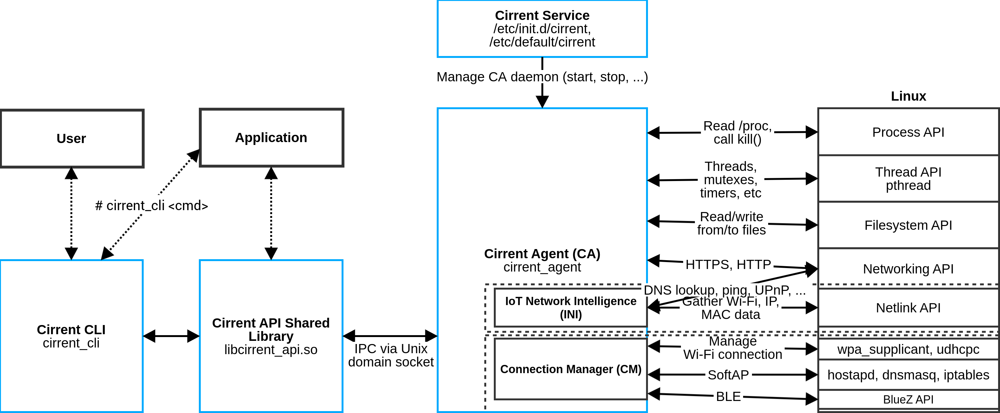

# Cirrent Agent on Linux

## Overview

The Cirrent Agent is compatible with  **Linux 2.2 and above**. It runs in userspace as a `cirrent_agent` daemon . The Cirrent Agent is delivered as a tarball comprised of:

-   Pre-compiled binaries compatible with your device’s architecture (armhf, x86, etc)

-   All necessary configuration files

-   Scripts for managing the Cirrent Agent

-   Shared libraries for working with the Cirrent Agent

Features include:

-   IoT Network Intelligence (INI)

-   Connection Manager (CM)

Source code available with Software License Agreement (SLA).

## Components

### cirrent_agent
An executable binary that runs as a daemon (cirrent_agent)

### libcirrent_api.so
Shared library for communicating and controlling the Cirrent Agent.

Communication and control of the Cirrent Agent is done either by linking in the libcirrent using the cirrent.h header or using the cirrent_cli shell utility (which internally uses the libcirrent)

### cirrent_cli
Shell utility for communicating and controlling the Cirrent Agent using the libcirrent_api.so library.

## Hardware Requirements
The Cirrent Agent hardware requirements depend on the feature being used.
### IoT Network Intelligence
* Wi-Fi Network Interface
    * STA mode
* Persistent Storage (Read/Write)
### Connection Manager
* Wi-Fi Network Interface
    * STA mode
    * AP mode (required for Soft-AP onboarding)
* BLE Radio (required for BLE onboarding)
* Persistent Storage (Read/Write)

## Software Requirements

Depending on the configuration for each feature, the Cirrent Agent may require root permissions or special file capabilities.
### IoT Network Intelligence
Configuration | Permissions/Capabilities
-|-
Trigger Wi-Fi Scans | Root Permission
Ping server | `CAP_NET_RAW` file capability _or_ Root permission

### Dependencies
On Linux, the CA relies on the following libraries that are linked directly into the CA.

Library/Application | Description | Required For | Notes
:-----------------: | :---------: | :--------: | :----:
`libc` | C library | INI, CM | C99
`libssl` | TLS Library | INI, CM | versions >= 1.0.2h |
`libcrypto` | crypto Library | INI, CM |
`libpthread` | thread Library | INI, CM |
`libcurl` | HTTP client library | INI, CM |
`librt` | realtime extensions library | INI, CM |
`libnl` | network information library | INI |
`libnl-genl` | network information library | INI |
`udhcpc` | DHCP Client | CM | Available with busybox
`libmicrohttpd` | HTTP server library | CM | Enables Wi-Fi onboarding
`dnsmasq` | DHCP Server | CM | Enables Wi-Fi onboarding

ℹ️ The following utilities on the target Linux device can make installation easier:

Utility | Description | Notes
------- | ----------- | -----:
`curl` | http client | Used during install for downloading files
`jq` | json parser | Used during install for parsing requests
